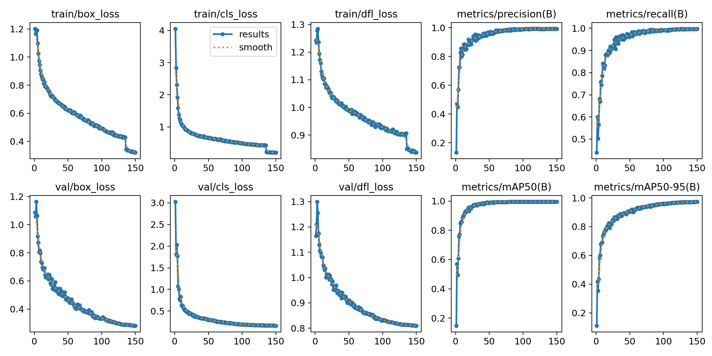
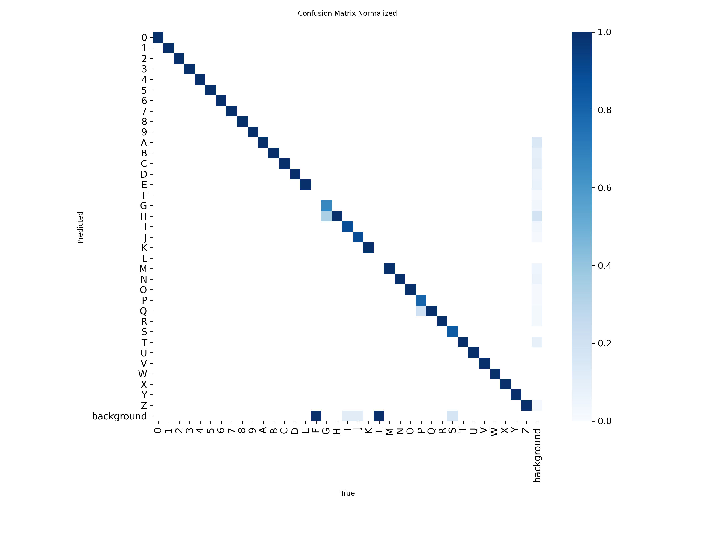

# Tile Character Detection — Training Pipeline

Training pipeline for a **YOLOv11n** object detection model that recognizes **36 alphanumeric characters (0-9, A-Z)** on physical letter tiles. The model exports to ONNX (~10 MB) and runs in-browser via ONNX Runtime WASM, powering real-time tile detection in the [Superbuilders](https://github.com/seanflanagan/superbuilders) iPad app.

## Results

The current model (**train3**) achieves **0.995 mAP50** and **0.973 mAP50-95** on validation, trained for 150 epochs on Kaggle P100. ONNX export is 10.6 MB.

| | |
|---|---|
|  |  |

See the [training guide](docs/training.md#current-model) for full metrics and methodology.

## How It Works

```
Record videos of tiles on iPad
        |
        v
 ffmpeg (2fps extraction)
        |
        v
 scripts/filter.py        Blur detection + perceptual hash dedup
        |
        v
 scripts/annotate.py      Gemini Flash Lite via OpenRouter (structured output)
        |
        v
 scripts/convert.py       Gemini JSON -> YOLO label format
        |
        v
 scripts/qa.py            Automated QA: class distribution, bbox geometry, consistency
        |
        v
 scripts/upload.py        Batch upload to Roboflow
        |
        v
 Roboflow                 Review, preprocessing, version generation, export
        |
        v
 yolo detect train        YOLOv11n, 640x640, fliplr=0.0
        |
        v
 yolo export format=onnx  ONNX for browser inference (~10 MB)
        |
        v
 Superbuilders app        Real-time detection on iPad Safari via WASM
```

## Project Structure

```
digit-training/
├── scripts/                    # Annotation + data pipeline
│   ├── config.py               #   36-class mapping, API config, annotation prompt
│   ├── filter.py               #   Blur detection + perceptual hash dedup
│   ├── annotate.py             #   Gemini annotation via OpenRouter
│   ├── convert.py              #   Gemini JSON -> YOLO label format
│   ├── qa.py                   #   Automated QA checks + visualization
│   ├── upload.py               #   Roboflow batch upload
│   ├── split.py                #   Stratified grouped split by video prefix
│   └── requirements.txt        #   Pipeline dependencies
├── docs/
│   ├── training.md             #   Comprehensive end-to-end training guide
│   ├── train3-results.png      #   Training curves (loss, mAP over epochs)
│   └── train3-confusion-matrix.png  #   Normalized confusion matrix
├── kaggle/
│   └── train-digit-tiles.ipynb #   Kaggle P100 training notebook (upload + run)
├── frames/                     #   Extracted video frames (git-ignored)
│   └── rejected/               #   Blurry/duplicate frames
├── auto_labels/                #   Pipeline output (git-ignored)
│   └── batch/
│       ├── raw_detections.json #     Gemini raw JSON
│       ├── labels/             #     YOLO .txt label files
│       └── qa/                 #     QA visualization images
├── dataset/                    #   Roboflow-exported YOLOv8 dataset (git-ignored)
├── runs/                       #   YOLO training outputs (git-ignored)
├── .env.example                #   API key template
└── .gitignore
```

## Setup

```bash
# Clone and create venv
git clone git@github.com:FlanaganSe/ml-digit-training.git
cd ml-digit-training
python3 -m venv .venv
source .venv/bin/activate

# Install training stack
pip install ultralytics albumentations

# Install annotation pipeline
pip install -r scripts/requirements.txt

# Install ffmpeg (for frame extraction)
brew install ffmpeg

# Configure API keys
cp .env.example .env
# Edit .env with your OpenRouter and Roboflow keys
```

## Running the Pipeline

Each script is a standalone CLI module. Run them in order:

```bash
source .venv/bin/activate

# 1. Extract frames from videos
for f in ~/Downloads/*.MOV; do
  name=$(basename "$f" .MOV)
  ffmpeg -i "$f" -vf fps=2 "frames/${name}_%04d.jpg"
done

# 2. Filter: remove blurry and near-duplicate frames
python -m scripts.filter

# 3. Annotate: Gemini auto-labels all frames
python -m scripts.annotate

# 4. Convert: Gemini JSON -> YOLO format
python -m scripts.convert

# 5. QA: validate annotations, check class distribution
python -m scripts.qa

# 6. Upload: send frames + labels to Roboflow
python -m scripts.upload
```

After upload, use the Roboflow UI to review annotations, generate a dataset version (with augmentation, **no manual splits**), and export in YOLOv8 format. Then run the local split:

```bash
# Download and extract the Roboflow export
rm -rf dataset
unzip ~/Downloads/digit-tiles-*.zip -d dataset

# Re-split by video prefix (Roboflow puts everything in train/)
python -m scripts.split
```

## Training

Training runs on **Kaggle P100 GPU** (~3.3 hours for 150 epochs). See [`kaggle/train-digit-tiles.ipynb`](kaggle/train-digit-tiles.ipynb) for the full notebook.

Alternatively, train locally on Apple Silicon:

```bash
yolo detect train \
  data=dataset/data.yaml \
  model=yolo11n.pt \
  epochs=150 \
  imgsz=640 \
  device=mps \
  fliplr=0.0 \
  flipud=0.0 \
  degrees=10 \
  hsv_v=0.5 \
  close_mosaic=15
```

Key constraints:
- **`fliplr=0.0`** is mandatory — mirrored characters (3, 7, 9, J, Z) are invalid training data
- **`imgsz=640`** must match export size for consistent inference
- **Grouped splits** via `scripts/split.py` — sequential video frames must stay in the same split to avoid data leakage

See [`docs/training.md`](docs/training.md) for the full guide covering video capture, evaluation, ONNX export, app integration, device testing, and deployment.

## Classes

36 classes: digits `0`-`9` (class IDs 0-9) and letters `A`-`Z` (class IDs 10-35).

Defined in [`scripts/config.py`](scripts/config.py).

## Annotation Architecture

The annotation pipeline uses **Gemini Flash Lite** via OpenRouter with structured JSON output. Key design decisions:

| Decision | Rationale |
|---|---|
| Gemini via OpenRouter (not direct API) | Structured output with `json_schema` mode + provider pinning |
| `is_prediction=False` on Roboflow upload | `True` routes to annotation jobs excluded from dataset versions |
| Perceptual hash dedup within video prefix only | Preserves cross-video diversity while removing sequential near-duplicates |
| API errors tracked separately from empty detections | Prevents silent failures from becoming false hard negatives |

## Tech Stack

| Component | Technology |
|---|---|
| Detection model | YOLOv11n (Ultralytics) |
| Annotation | Gemini Flash Lite via OpenRouter |
| Dataset management | Roboflow |
| Frame filtering | Laplacian variance + imagehash |
| Inference runtime | ONNX Runtime Web (WASM) |
| Training hardware | Apple Silicon (MPS) or Kaggle (P100) |
| Deployment target | iPad Safari via Cloudflare Pages |

## Documentation

- **[Training Guide](docs/training.md)** — End-to-end walkthrough: video capture, frame extraction, annotation, Roboflow workflow, training, evaluation, ONNX export, app integration, and device testing.
- **[Kaggle Notebook](kaggle/train-digit-tiles.ipynb)** — Ready-to-run training notebook for Kaggle P100 GPU.
- **[Class Config](scripts/config.py)** — 36-class mapping, API configuration, and annotation prompt.

## Known Pitfalls

| Pitfall | Consequence | Prevention |
|---|---|---|
| `fliplr` not set to `0.0` | Mirrored characters corrupt training | Always pass `fliplr=0.0` explicitly |
| Roboflow resize set to "Stretch" | Distorts character proportions | Use "Fit (white edges)" |
| Random train/val split | Near-duplicate leakage inflates metrics | Split by video source |
| Augmented val/test sets | Duplicate copies inflate mAP | Augment training set only |
| Horizontal/vertical flip augmentation | Invalid character representations | Disable in both Roboflow and YOLO |

## Closing thoughts:

- I would not recommend training on an M3 mac again. Kaggle was a far better experience
- I would not recommend annotating cards manually except with small datasets and for testing periods. Gemini flash annotations were equally accurate and the process to manually annotate in roboflow took ~1 hour for 100 cards. Gemini-flash could do 2000 images in <30 minutes. 